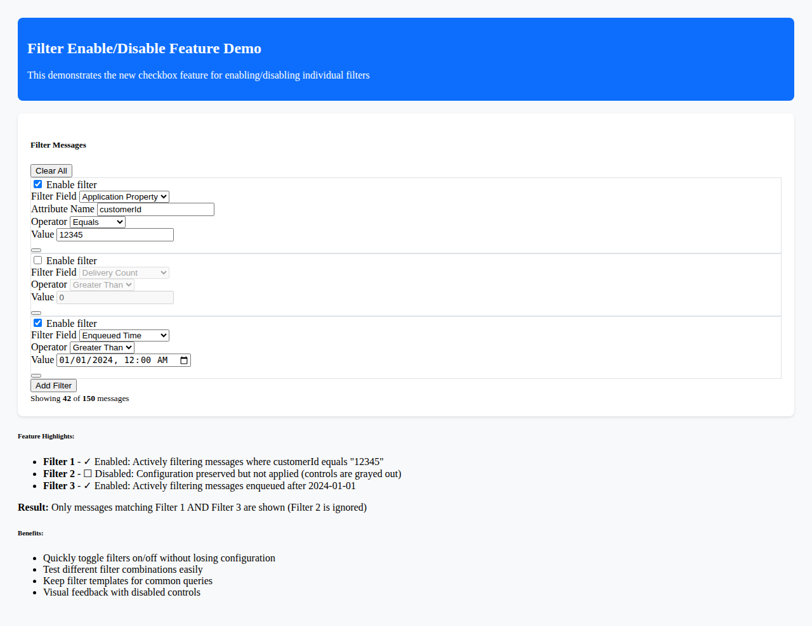

# Enable/Disable Individual Filters Feature

## Overview

This feature allows users to temporarily enable or disable individual message filters without removing them from the filter list. This is useful when you want to:
- Quickly compare filtered vs. unfiltered results
- Test different filter combinations without losing your filter configuration
- Keep filter configurations for later use while viewing all messages

## Screenshot



*The screenshot shows three filters: Filter 1 (enabled), Filter 2 (disabled with grayed-out controls), and Filter 3 (enabled). Only enabled filters are applied to the message list.*

## User Interface

### Filter Checkbox

Each filter row now includes a checkbox at the beginning:
- **Checked (✓)**: Filter is enabled and actively filtering messages
- **Unchecked ( )**: Filter is disabled and not applied to messages

When a filter is disabled:
- All filter controls (Field, Attribute Name, Operator, Value) are grayed out/disabled
- The filter configuration is preserved but not applied
- The filter count and message results update immediately

## How to Use

### Disabling a Filter

1. Locate the filter you want to disable in the filter panel
2. Uncheck the checkbox at the beginning of the filter row
3. The filter controls become disabled (grayed out)
4. Messages are immediately re-filtered without this filter
5. The filtered message count updates to reflect the change

### Enabling a Filter

1. Locate the disabled filter (unchecked checkbox)
2. Check the checkbox at the beginning of the filter row
3. The filter controls become enabled again
4. The filter is immediately applied to the messages
5. The filtered message count updates to reflect the change

## Examples

### Example 1: Temporarily Disable a Filter
You have three filters configured:
1. Filter 1: Delivery Count > 0 ✓ (enabled)
2. Filter 2: Attribute "customerId" = "123" ✓ (enabled)
3. Filter 3: Enqueued Time > 2024-01-01 ✓ (enabled)

To see results without the time filter, simply uncheck Filter 3. The filter configuration remains, but it's not applied.

### Example 2: Test Filter Combinations
You can quickly test different filter combinations:
- Enable all three filters to see highly specific results
- Disable Filter 2 to see all customers (not just customerId "123")
- Disable Filters 2 and 3 to see only messages with delivery count > 0

### Example 3: Keep Filter Templates
Create filters for common queries and disable them when not needed:
- Create a "High Priority" filter (disabled by default)
- Create a "Retry Messages" filter (DeliveryCount > 1, disabled by default)
- Enable them only when investigating specific issues

## Technical Implementation

### Domain Model Changes

**File**: `SBInspector.Shared/Core/Domain/MessageFilter.cs`

Added `IsEnabled` property:
```csharp
public class MessageFilter
{
    public FilterField Field { get; set; } = FilterField.ApplicationProperty;
    public string AttributeName { get; set; } = string.Empty;
    public string AttributeValue { get; set; } = string.Empty;
    public FilterOperator Operator { get; set; } = FilterOperator.Contains;
    public bool IsEnabled { get; set; } = true; // New property, defaults to enabled
    
    // ... other properties
}
```

### Service Layer Changes

**File**: `SBInspector.Shared/Application/Services/MessageFilterService.cs`

Updated `ApplyFilters` method to skip disabled filters:
```csharp
public IEnumerable<MessageInfo> ApplyFilters(IEnumerable<MessageInfo> messages, List<MessageFilter> filters)
{
    // Check if there are any enabled filters with values
    if (filters == null || !filters.Any(f => f.IsEnabled && (!string.IsNullOrWhiteSpace(f.AttributeName) || !string.IsNullOrWhiteSpace(f.AttributeValue))))
    {
        return messages;
    }

    // Apply only enabled filters (disabled filters are skipped)
    return messages.Where(message => filters.All(filter => !filter.IsEnabled || MatchesFilter(message, filter)));
}
```

**Logic**: The filter logic uses short-circuit evaluation: if a filter is disabled (`!filter.IsEnabled`), it automatically passes without checking `MatchesFilter`.

### UI Component Changes

**File**: `SBInspector.Shared/Presentation/Components/UI/MessageFilterPanel.razor`

Added checkbox control:
```razor
<div class="col-auto d-flex align-items-center">
    <div class="form-check">
        <input class="form-check-input" type="checkbox" id="filterEnabled_@index" 
               checked="@filter.IsEnabled"
               @onchange="@(async e => { filter.IsEnabled = (bool)(e.Value ?? true); await NotifyFiltersChanged(); })"
               title="Enable or disable this filter" />
        <label class="form-check-label visually-hidden" for="filterEnabled_@index">
            Enable filter
        </label>
    </div>
</div>
```

All input controls are disabled when `filter.IsEnabled` is false:
```razor
<select class="form-select form-select-sm" id="filterField_@index" 
        value="@filter.Field" 
        disabled="@(!filter.IsEnabled)"
        @onchange="...">
```

## Behavior Details

### State Management
- Filter enabled/disabled state is part of the filter object
- State changes trigger immediate re-filtering via `FiltersChanged` callback
- State is preserved when adding or removing other filters

### Persistence
- The `IsEnabled` state is part of the `MessageFilter` model
- If filters are saved/persisted, the enabled state is included
- New filters default to enabled (`IsEnabled = true`)

### AND Logic with Multiple Filters
When multiple filters are configured, they work together with AND logic:
- All **enabled** filters must match for a message to be included
- Disabled filters are ignored in the AND evaluation

Example:
- Filter 1 (enabled): DeliveryCount > 0
- Filter 2 (disabled): CustomerId = "123"
- Filter 3 (enabled): EnqueuedTime > 2024-01-01

Result: Shows messages where DeliveryCount > 0 **AND** EnqueuedTime > 2024-01-01 (Filter 2 is ignored)

## User Experience Benefits

1. **Non-Destructive Filtering**: Keep your filter configurations while experimenting
2. **Quick Toggle**: Enable/disable filters with a single click
3. **Visual Feedback**: Grayed-out controls clearly show disabled state
4. **Immediate Updates**: Message list updates instantly when toggling filters
5. **Filter Library**: Build a collection of useful filters and enable them as needed

## Related Features

- [Operator-Based Filtering](OPERATOR_FILTERING.md) - Learn about filter operators and fields
- [Message Operations](FILTER_BASED_OPERATIONS.md) - Use filters with Delete/Export operations
- [Pagination](PAGINATION.md) - How filters work with pagination
